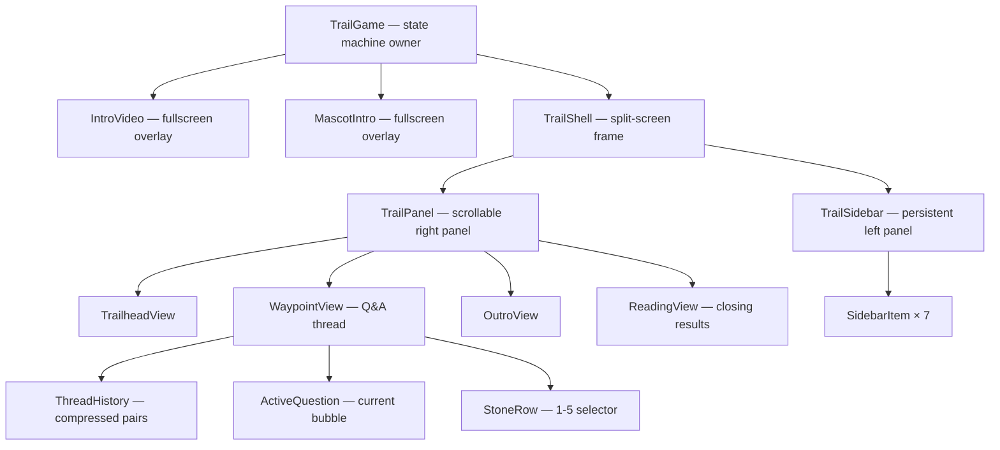
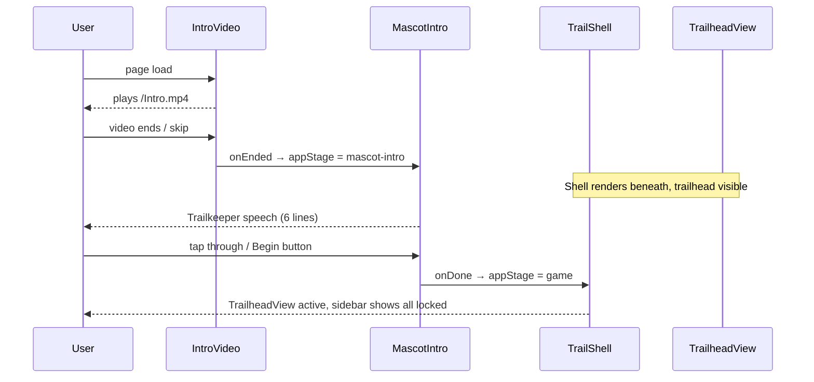
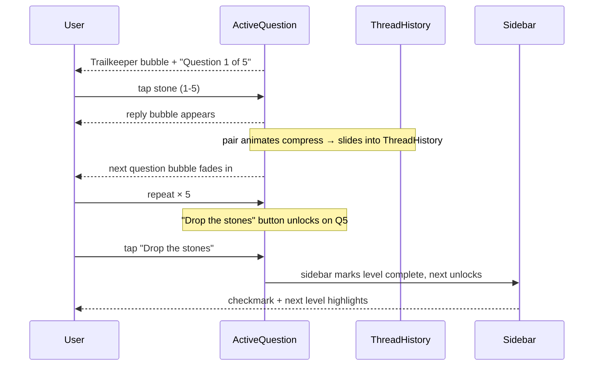

# Design Document: Resilience Trail Layout Redesign

## Overview

This document covers the UI/layout redesign of *The Resilience Trail* — a seven-level wellness self-assessment game built in React 19 + TanStack Router + Tailwind CSS v4. The redesign introduces a persistent split-screen shell with a left sidebar showing level navigation state and a right panel that renders the active Q&A thread as a chat-bubble conversation. The existing game logic, state machine, content, and Trailkeeper voice are preserved; only the visual layout layer changes.

The new layout replaces the current full-width scrolling single-column view with a two-pane shell. The sidebar gives players a persistent spatial map of their progress. The right panel makes the Q&A feel like a dialogue rather than a form — questions appear as Trailkeeper bubbles, stone selections appear as reply bubbles, and answered pairs compress upward into thread history as the conversation advances.

---

## Architecture



The `TrailGame` component in `src/routes/index.tsx` remains the single state owner. `TrailShell` is a new layout wrapper that owns no state; it receives sidebar data as props and renders the two-pane frame. All phase transitions (`trailhead → waypoint → outro → reading`) continue to be driven by the existing `Phase` union type.

`IntroVideo` and `MascotIntro` render as `position: fixed` fullscreen overlays above the shell, exactly as today — no structural change required. The shell renders underneath them during `appStage === "mascot-intro"` and becomes interactive once `appStage === "game"`.

---

## Sequence Diagrams

### Game Startup Flow



### Q&A Thread Flow (per waypoint)



---

## Components and Interfaces

### TrailShell

**Purpose**: The split-screen frame. Renders sidebar on the left and the active panel on the right. Knows nothing about game logic — pure layout.

```typescript
interface TrailShellProps {
  sidebarItems: SidebarItemData[];
  activeIndex: number | null;   // null during trailhead / reading
  children: React.ReactNode;    // panel content
}

interface SidebarItemData {
  id: string;
  name: string;
  subtitle: string;
  color: LevelColor;
  status: "locked" | "active" | "complete";
  average: number | null;       // null until complete
}
```

**Responsibilities**:
- CSS grid `[sidebar] [panel]` layout, fixed viewport height
- Passes `sidebarItems` to `TrailSidebar`
- On mobile: sidebar collapses to a horizontal strip at the top
- No scroll — the panel child scrolls internally

### TrailSidebar

**Purpose**: Vertical list of all 7 levels with icon, name, and status marker.

```typescript
interface TrailSidebarProps {
  items: SidebarItemData[];
  activeIndex: number | null;
}
```

**Responsibilities**:
- Renders 7 `SidebarItem` rows
- Active item has full-color left border + tinted background
- Complete items show checkmark icon; locked items show lock icon
- Branding header (`The Resilience Trail`) pinned at top
- No interactivity — levels advance automatically, sidebar is display-only

### SidebarItem

```typescript
interface SidebarItemProps {
  item: SidebarItemData;
  isActive: boolean;
}
```

Status visual mapping:
| Status | Icon | Treatment |
|--------|------|-----------|
| `locked` | `Lock` (lucide) | Muted ink, `opacity-40` |
| `active` | Level number | Level color border-left, tinted bg |
| `complete` | `Check` (lucide) | Level color icon, full opacity |

### TrailPanel

**Purpose**: The scrollable right-side panel. Wraps panel content with consistent padding and `overflow-y: auto`. Contains the auto-scroll anchor.

```typescript
interface TrailPanelProps {
  levelColor: LevelColor | null;   // null at trailhead/reading
  children: React.ReactNode;
}
```

Scrolls to bottom on each new bubble mount via `useEffect` + `scrollIntoView`.

### WaypointView (redesigned)

The waypoint view becomes a Q&A thread instead of a form. It owns local state for which question is currently active.

```typescript
interface WaypointViewProps {
  waypoint: Waypoint;
  index: number;
  answers: number[];
  onAnswer: (qi: number, v: number) => void;
  canAdvance: boolean;
  onAdvance: () => void;
}

// Local state inside WaypointView:
// activeQuestion: number  — 0..4, advances after each stone tap
// committed: boolean[]    — which questions have been answered and compressed
```

**Responsibilities**:
- Renders `ThreadHistory` (committed Q&A pairs)
- Renders `ActiveQuestion` for `answers[activeQuestion]`
- `"Question X of 5"` counter above the thread
- Trailkeeper scene-setting bubble and intro bubble appear before Q1
- After stone tap on question N: marks committed[N]=true, advances `activeQuestion` to N+1
- After Q5 answered: shows "Drop the stones" button

### ThreadHistory

```typescript
interface ThreadHistoryProps {
  waypoint: Waypoint;
  answers: number[];
  committedCount: number;  // how many pairs to render
  levelColor: LevelColor;
}
```

Renders `committedCount` question+answer bubble pairs. Each pair is visually compressed — smaller font, reduced padding, muted treatment — to distinguish from the active question.

### ActiveQuestion

```typescript
interface ActiveQuestionProps {
  question: string;
  questionIndex: number;   // 0-based
  totalQuestions: number;  // always 5
  value: number;           // 0 = unselected
  levelColor: LevelColor;
  onSelect: (v: number) => void;
}
```

Renders a Trailkeeper bubble with the question text and a `StoneRow` beneath it. After selection, a reply bubble appears above the `StoneRow` before the pair compresses.

### StoneRow

```typescript
interface StoneRowProps {
  value: number;
  levelColor: LevelColor;
  onSelect: (v: number) => void;
  disabled?: boolean;
}
```

Five circular stone tokens. Unselected: `border-1px` outline in `--color-border`, transparent fill. Selected: solid fill in `levelColor`, white numeral. Hover: tinted background.


### TrailheadView

Replaces the current `Trailhead` component. Renders within `TrailPanel` using bubble styling: Trailkeeper avatar + speech bubble for the greeting, then the two CTA buttons ("Begin the trail" / "Ask what this is for"). The "expanded" prevention-themed speech uses a second Trailkeeper bubble that fades in.

```typescript
interface TrailheadViewProps {
  expanded: boolean;
  onToggle: () => void;
  onBegin: () => void;
}
```

### OutroView (redesigned)

After "Drop the stones", renders within `TrailPanel`:
1. Level average summary card (tinted background, large score, `/5`)
2. Trailkeeper outro bubble
3. "Walk on" / "The Reading" button

Sidebar updates (level → complete, next → active) happen before this view renders, triggered by `onAdvance` in the parent.

### ReadingView (redesigned)

Renders in `TrailPanel`. Sidebar shows all 7 complete. Content:
- Animated score reveal: 7 colored dots animate in sequentially, then total score counts up
- Total out of 35 with band label
- Trailkeeper narrative outcome bubble (one of four bands)
- Trailkeeper stone-pouch outro bubble
- "Walk it again" button

```typescript
interface ReadingViewProps {
  total: number;
  averages: number[];
  onReset: () => void;
}
```

---

## Data Models

### LevelColor type

```typescript
type LevelColor = "orange" | "green" | "teal" | "darkgreen";
```

Color assignments (from spec):

| Level | Color token | Hex |
|-------|------------|-----|
| Orchard (Nutrition) | `green` | `#99cf16` |
| Long Night (Sleep) | `orange` | `#ff8f00` |
| Storm Shelter (Stress) | `teal` | `#66c3b7` |
| Still River (Emotional) | `teal` | `#66c3b7` |
| Climb (Movement) | `green` | `#99cf16` |
| Clearing (Environmental) | `darkgreen` | `#0e5046` |
| Campfire (Relationships) | `orange` | `#ff8f00` |

> Note: existing `WAYPOINTS` array already has correct color assignments for all but two entries. The Long Night is currently `darkgreen` — this needs to change to `orange`. The Campfire is `orange` which is correct.

### CSS Variable Strategy

All color tokens live as CSS custom properties on `:root`. Tailwind v4 `@theme inline` maps them to utility-accessible variables. No changes to existing variables are needed except adding the missing `--lc-sage` token and correcting the Long Night color in `WAYPOINTS`.

New variables to add to `styles.css`:

```css
:root {
  /* existing tokens stay unchanged */

  /* Sage tint (used for darkgreen level backgrounds) */
  --lc-sage: oklch(0.88 0.02 175);

  /* App base */
  --lc-off-white: #fafaf8;   /* already covered by --lc-sand ≈ #fafaf7 */
}
```

`@theme inline` additions:

```css
--color-sage: var(--lc-sage);
--color-sage-tint: var(--lc-darkgreen-tint);  /* reuse */
```

Per-level CSS variables injected inline via `style` prop on `TrailPanel` (so child components can reference `var(--level-color)` and `var(--level-tint)`):

```typescript
// Inside TrailPanel render:
style={{
  "--level-color": `var(--color-${levelColor})`,
  "--level-tint": `var(--color-${levelColor}-tint)`,
} as React.CSSProperties}
```

---

## Layout Implementation

### Desktop Layout (≥ 768px)

```
┌──────────────────────────────────────────────────────────────┐
│  [Sidebar 240px fixed]  │  [Panel — fills remaining width]   │
│                         │                                     │
│  The Resilience Trail   │  ┌─────────────────────────────┐   │
│  ─────────────────────  │  │  Question 3 of 5            │   │
│  ✓ 1 · The Orchard      │  │                             │   │
│  ✓ 2 · The Long Night   │  │  [Thread history — muted]   │   │
│  ● 3 · Storm Shelter ◄  │  │                             │   │
│  🔒 4 · Still River     │  │  [Active question bubble]   │   │
│  🔒 5 · The Climb       │  │  [Stone row 1–5]            │   │
│  🔒 6 · The Clearing    │  │                             │   │
│  🔒 7 · The Campfire    │  └─────────────────────────────┘   │
│                         │                                     │
└──────────────────────────────────────────────────────────────┘
```

CSS grid implementation:

```css
.trail-shell {
  display: grid;
  grid-template-columns: 240px 1fr;
  grid-template-rows: 100dvh;
  overflow: hidden;
}

.trail-sidebar {
  grid-column: 1;
  overflow-y: auto;
  border-right: 1px solid var(--color-border);
}

.trail-panel {
  grid-column: 2;
  overflow-y: auto;
  padding: 2rem 2.5rem 6rem;
}
```

### Mobile Layout (< 768px)

Sidebar collapses to a horizontal strip at the top (height ~56px). Shows 7 small dot indicators: locked = empty circle, active = filled dot in level color, complete = checkmark dot. The panel occupies the remaining viewport height.

```css
@media (max-width: 767px) {
  .trail-shell {
    grid-template-columns: 1fr;
    grid-template-rows: 56px 1fr;
  }

  .trail-sidebar {
    grid-column: 1;
    grid-row: 1;
    border-right: none;
    border-bottom: 1px solid var(--color-border);
    /* horizontal flex of 7 dots */
    display: flex;
    align-items: center;
    justify-content: center;
    gap: 0.75rem;
    overflow: visible;
  }

  .trail-panel {
    grid-column: 1;
    grid-row: 2;
    padding: 1.25rem 1rem 5rem;
  }
}
```

The `TrailheadView` and `ReadingView` (which have no active sidebar item) render with `activeIndex={null}` — the sidebar shows all locked (trailhead) or all complete (reading).

---

## Q&A Thread / Chat Bubble Pattern

### Bubble Anatomy

Two bubble variants:

**Trailkeeper bubble** (left-aligned):
- Small Trailkeeper avatar (32×32px circle, `src/masqot.png`) to the left
- Bubble: `background: var(--color-background)`, `border: 1px solid var(--color-border)`, `border-radius: 4px 16px 16px 16px`
- Typography: Fraunces italic for speech, League Spartan for stage directions
- Max width: 85% of panel width

**Player reply bubble** (right-aligned):
- Bubble: `background: var(--level-tint)`, `border: 1px solid var(--level-color) / 0.3`, `border-radius: 16px 4px 16px 16px`
- Content: "Stone {n} — {label}" where label is the 1-word descriptor
- Max width: 60% of panel width

Stone value labels: `1 → Needs work · 2 → Struggling · 3 → Getting by · 4 → Solid · 5 → Thriving`

### Compression Animation

When a Q&A pair is committed (stone selected, `activeQuestion` advances):

1. The pair receives `data-committed="true"`
2. CSS transition reduces `font-size` from `1rem` to `0.8rem`, `padding` to 50%, `opacity` to `0.55` over `250ms ease`
3. The pair joins `ThreadHistory` — rendered as static, compressed nodes above the active question
4. The panel auto-scrolls to the bottom via `scrollIntoView({ behavior: "smooth" })` on the active question ref

```typescript
// Inside WaypointView
const bottomRef = useRef<HTMLDivElement>(null);

useEffect(() => {
  bottomRef.current?.scrollIntoView({ behavior: "smooth", block: "end" });
}, [activeQuestion]);
```

CSS for committed pairs:

```css
.bubble-pair[data-committed="true"] .bubble {
  font-size: 0.8rem;
  padding: 0.5rem 0.75rem;
  opacity: 0.55;
  transition: all 0.25s ease;
}
```

### Question Counter

Fixed above the thread, below any panel header:

```
Question 3 of 5 · The Storm Shelter
```

Typography: League Spartan, `11px`, `tracking-[0.25em]`, uppercase, `color: var(--color-muted-foreground)`.

---

## Animation Approach

| Animation | Mechanism | Duration |
|-----------|-----------|----------|
| New question bubble fade-in | `opacity: 0 → 1`, `translateY(8px → 0)` | 200ms ease |
| Reply bubble appear | `opacity: 0 → 1`, `scale(0.95 → 1)` | 150ms ease |
| Pair compress into history | Font/padding/opacity transition | 250ms ease |
| Sidebar status change | `opacity` cross-fade on icon swap | 200ms ease |
| Reading score count-up | `useEffect` counter with `requestAnimationFrame` | 800ms |
| Level dots animate in (Reading) | Staggered `opacity` delay per dot | 60ms per dot |

All animations use CSS transitions where possible (no JS animation library required). The `tw-animate-css` package already in the project provides `animate-fade-in` and `animate-scale-in` utilities that can be applied via Tailwind classes.

---

## Integration with Existing Components

### IntroVideo.tsx

No changes required. It renders `position: fixed; z-index: 9999` — sits above the shell regardless of layout.

### MascotIntro.tsx

No changes required. It renders `position: fixed; z-index: 9998`. The shell renders underneath it during `appStage === "mascot-intro"`, so the trailhead is "warmed up" visually before MascotIntro dismisses.

One minor improvement: update `appStage === "mascot-intro"` render in `TrailGame` to pass `sidebarItems` with all `status: "locked"` to `TrailShell` instead of the current `TopBar` + bare `Trailhead`. This means the shell frame is visible through the MascotIntro overlay.

### TopBar / CircleOfLife

The existing `TopBar` and `CircleOfLife` SVG components are replaced by the sidebar in the new layout. The `CircleOfLife` can be repurposed inside `ReadingView` as a decorative final score visualisation (it already handles `averages` and renders filled arcs). `TopBar` is removed.

### State Machine in TrailGame

The existing `Phase` union and all transition functions (`begin`, `advanceFromWaypoint`, `advanceFromOutro`, `reset`) are unchanged. The only addition is computing `sidebarItems` from `phase` + `waypointAverages`:

```typescript
const sidebarItems: SidebarItemData[] = WAYPOINTS.map((w, i) => {
  const isActive =
    (phase.kind === "waypoint" || phase.kind === "outro") && phase.index === i;
  const isComplete = waypointAverages[i] > 0;
  return {
    id: w.id,
    name: w.name,
    subtitle: w.subtitle,
    color: w.color,
    status: isComplete ? "complete" : isActive ? "active" : "locked",
    average: isComplete ? waypointAverages[i] : null,
  };
});
```

The `activeIndex` passed to `TrailShell`:
```typescript
const activeIndex =
  phase.kind === "waypoint" ? phase.index :
  phase.kind === "outro" ? phase.index :
  null;
```


---

## Typography

| Use | Font | Weight | Style |
|-----|------|--------|-------|
| UI chrome, sidebar, labels, headers | League Spartan | 400–600 | normal |
| Trailkeeper speech, stage directions | Fraunces | 400 | italic |
| Stone labels, counters | League Spartan | 500 | normal |
| Score numbers | League Spartan | 600 | normal |

Font loading is already handled in `__root.tsx` via Google Fonts `<link>` tags. No changes needed.

---

## Error Handling

| Scenario | Response |
|----------|----------|
| Stone not yet selected, "Drop the stones" tapped | Button is `disabled` (no-op) until all 5 answered |
| Video playback fails | `IntroVideo` catches `.play()` rejection and calls `onEnded()` immediately — unchanged |
| `speechSynthesis` unavailable | `MascotIntro` checks `"speechSynthesis" in window` — unchanged |
| `answers` state inconsistency | `allAnswered()` guards advance; `waypointAverages` returns `0` for incomplete waypoints |
| Sidebar in trailhead/reading (no active level) | `activeIndex={null}` — sidebar renders all locked or all complete, no highlight |

---

## Testing Strategy

### Unit Testing Approach

Key pure functions to test:
- `getBand(total)` — correct band + color for all four ranges (boundary values: 14, 15, 21, 22, 29, 30, 35)
- `sidebarItems` computation — given various `Phase` + `waypointAverages`, correct `status` per item
- `allAnswered(wpId)` — returns false if any answer is 0, true only when all five are ≥ 1
- `waypointAverages` memo — rounds correctly, returns 0 for incomplete waypoints

### Property-Based Testing Approach

**Property Test Library**: fast-check (to be installed as `fast-check@^3.22.0`)

Properties:
1. **Score invariant**: For any 7 averages in `[1..5]`, `total ∈ [7..35]` and `getBand(total)` always returns a defined band.
2. **Sidebar completeness**: For any valid `Phase` and any `waypointAverages`, exactly one level is `active` (when in waypoint/outro) or zero are active (trailhead/reading), and no level is both `active` and `complete`.
3. **Thread ordering**: After answering N questions, `committedCount === N` and `activeQuestion === N` (where N < 5).
4. **Stone token selection**: Selecting stone N deselects any previously selected stone for that question — only one value per question slot.

### Integration Testing Approach

Manual smoke test checklist (no automated integration tests required given the overlay complexity):
1. Full trail run: video → mascot → trailhead → 7 levels → reading
2. "Ask what this is for" toggles and restores correctly
3. Sidebar progresses correctly level-by-level
4. Responsive breakpoint: at 767px sidebar becomes top strip
5. "Walk it again" resets sidebar to all-locked and returns to trailhead

---

## Performance Considerations

- `TrailPanel` uses `overflow-y: auto` — only the panel scrolls; the sidebar and shell frame are fixed. This avoids full-page reflows during thread growth.
- `ThreadHistory` renders committed pairs as static JSX (no memoisation needed — maximum 4 pairs at once).
- `CircleOfLife` SVG is lightweight (7 arc paths). Retained as-is for the Reading view.
- Score count-up animation uses `requestAnimationFrame` with a duration cap to avoid janky frames on low-power devices.
- Google Fonts are already `display=swap` — no layout shift.
- The mascot PNG (`src/masqot.png`) is loaded once at app start. The 32px sidebar avatar is the same image scaled via CSS.

---

## Security Considerations

- No user data leaves the client. `answers` state is ephemeral React state — no persistence, no network calls.
- `speechSynthesis` API is used read-only (speaks text from the hardcoded `SPEECH_LINES` array). No user input is passed to TTS.
- All content (questions, Trailkeeper lines) is static, hardcoded strings — no dynamic string injection.

---

## Dependencies

No new runtime dependencies are required for the layout redesign. The project already has:

| Dependency | Use in redesign |
|------------|----------------|
| `react@^19.2.0` | Component model, `useRef`, `useEffect`, `useState` |
| `tailwindcss@^4.2.1` | Layout utilities, responsive breakpoints |
| `tw-animate-css@^1.3.4` | Bubble entrance animations (`animate-fade-in`) |
| `lucide-react@^0.575.0` | `Lock`, `Check` icons for sidebar status |
| `@radix-ui/react-scroll-area` | Optional: accessible scroll container for `TrailPanel` |

Optional addition for property-based tests only:
```
fast-check@^3.22.0  (devDependency)
```

No CSS framework changes — the existing Tailwind v4 `@theme inline` setup and CSS variable strategy in `styles.css` is extended, not replaced.

---

## File Structure After Redesign

```
src/
  components/
    IntroVideo.tsx         (unchanged)
    MascotIntro.tsx        (unchanged)
    trail/
      TrailShell.tsx       (new — split-screen frame)
      TrailSidebar.tsx     (new — persistent left panel)
      TrailPanel.tsx       (new — scrollable right panel)
      SidebarItem.tsx      (new — single sidebar row)
      WaypointView.tsx     (new — Q&A thread view, replaces inline component)
      ThreadHistory.tsx    (new — compressed Q&A pairs)
      ActiveQuestion.tsx   (new — current question + stone row)
      StoneRow.tsx         (new — 1-5 stone token selector)
      TrailheadView.tsx    (new — bubble-styled trailhead)
      OutroView.tsx        (new — level complete summary)
      ReadingView.tsx      (new — animated final results)
      TrailkeeperBubble.tsx (new — left-aligned speech bubble)
      PlayerBubble.tsx     (new — right-aligned reply bubble)
  routes/
    index.tsx              (modified — TrailGame wires shell, removes TopBar)
  styles.css               (modified — add --lc-sage token)
```

All new components live under `src/components/trail/` to keep the flat `components/` folder clean and to make the trail feature self-contained.

---

## Correctness Properties

These properties hold universally across all valid game states and must not be violated by any implementation.

### Property 1: Sidebar status mutual exclusivity

For any valid `Phase` and any `waypointAverages: number[]`:
- At most one sidebar item has `status === "active"` at any time
- No item can be both `"active"` and `"complete"` simultaneously
- Items with `waypointAverages[i] > 0` always have `status === "complete"`

```typescript
// fast-check property
fc.assert(fc.property(
  fc.constantFrom(...validPhases),
  fc.array(fc.integer({ min: 0, max: 5 }), { minLength: 7, maxLength: 7 }),
  (phase, averages) => {
    const items = computeSidebarItems(phase, averages);
    const activeCount = items.filter(i => i.status === "active").length;
    const contradiction = items.some(i => i.status === "active" && i.average !== null);
    return activeCount <= 1 && !contradiction;
  }
));
```

### Property 2: Score invariant

For any 7 per-level averages where each is in `[1..5]`, the total is in `[7..35]` and `getBand` returns a defined result:

```typescript
fc.assert(fc.property(
  fc.array(fc.integer({ min: 1, max: 5 }), { minLength: 7, maxLength: 7 }),
  (averages) => {
    const total = averages.reduce((a, b) => a + b, 0);
    const band = getBand(total);
    return total >= 7 && total <= 35 && band !== null && band.label.length > 0;
  }
));
```

### Property 3: Thread state consistency

After answering `N` questions in a waypoint (N in `[0..5]`), the thread always satisfies:
- `committedCount === N`
- `activeQuestion === Math.min(N, 4)` (clamps at last question)
- `canAdvance === (N === 5)`

```typescript
fc.assert(fc.property(
  fc.integer({ min: 0, max: 5 }),
  (n) => {
    const answers = Array(5).fill(0).map((_, i) => (i < n ? fc.sample(fc.integer({ min: 1, max: 5 }), 1)[0] : 0));
    return deriveThreadState(answers).committedCount === n
      && deriveThreadState(answers).activeQuestion === Math.min(n, 4)
      && deriveThreadState(answers).canAdvance === (n === 5);
  }
));
```

### Property 4: Stone selection is single-valued

Selecting stone `v` for question `qi` produces an `answers` array where `answers[qi] === v` and all other indices are unchanged:

```typescript
// Example-based assertion (pure function)
const before = [3, 0, 0, 0, 0];
const after = setAnswer("orchard", 1, 4)(before);
assert(after[1] === 4);
assert(after[0] === 3); // unchanged
```

### Property 5: Reading view sidebar completeness

When `phase.kind === "reading"` and all 7 `waypointAverages[i] > 0`, every sidebar item has `status === "complete"` and `activeIndex === null`.

### Property 6: Overlay independence

Given `appStage === "mascot-intro"`, `IntroVideo` is not rendered and `MascotIntro` renders with `z-index: 9998` above the shell frame. `TrailShell` is present in the DOM but non-interactive beneath the overlay.
